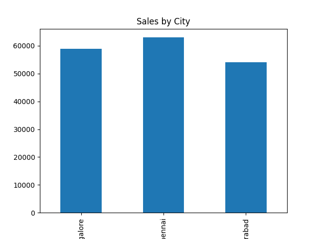

# 📈 Customer Sales Analysis

## 📋 Project Overview
End-to-end sales data analysis project using Python, SQL, and Power BI to identify top-performing cities, product categories, and customer segments — turning raw sales data into actionable business insights.

## 🎯 Business Problem
A retail business needed clarity on which cities, categories, and customers were driving the most revenue, so leadership could make informed decisions on where to focus sales and marketing efforts.

## 🛠️ Tools & Technologies
| Tool | Purpose |
|------|---------|
| Python (Pandas, NumPy) | Data cleaning and exploratory data analysis |
| MySQL | Data aggregation, filtering, and segmentation |
| Power BI | Interactive dashboard with KPIs and visual insights |
| Matplotlib | Supporting charts and visualizations |

## 🔍 Project Workflow
1. **Data Collection** — Loaded raw sales data (sales.csv)
2. **Data Cleaning** — Handled missing values and inconsistent formatting using Python
3. **Exploratory Data Analysis (EDA)** — Explored trends across cities, categories, and time periods
4. **SQL Analysis** — Wrote queries to aggregate and segment sales data
5. **Dashboard** — Built an interactive Power BI dashboard with KPIs and charts
6. **Insights** — Identified key business takeaways from the analysis

## 📁 Repository Structure

customer-sales-analysis/

├── src/

│   └── analysis.py

├── data/

│   └── sales.csv

├── sql/

│   └── sql_queries.sql

└── dashboard/

├── sales_dashboard.pbix

└── chart.png

## 📊 Dashboard Preview

## 🚀 How to Run This Project
1. Clone this repository: `git clone https://github.com/Prasadreddy17/customer-sales-analysis`
2. Install required libraries: `pip install pandas numpy matplotlib`
3. Run the analysis script: `python src/analysis.py`
4. Open `sql/sql_queries.sql` in MySQL Workbench to run the SQL queries
5. Open `dashboard/sales_dashboard.pbix` in Power BI Desktop to view the interactive dashboard

## 📬 Contact
**Goli Krishna Prasad Reddy**
📧 golikrishnaprasadreddy@gmail.com
🔗 [LinkedIn](https://linkedin.com/in/krishna-prasad-reddy)
